# Slack-Zeon Architecture

> A comprehensive Slack bot built with `@slack/bolt` featuring 37 commands, 40+ modules, and extensive integrations.

## High-Level Architecture Diagram

```mermaid
flowchart TB
    subgraph Entry["🚀 Bootstrap (index.ts)"]
        Init[index.ts<br/>Composition Root]
    end

    subgraph SlackLayer["📡 Slack Layer"]
        BoltApp[Bolt App<br/>HTTP Server :3000]
        SlackAPI[Slack Platform<br/>Events + Web API]
    end

    subgraph CommandSystem["⚡ Command System"]
        CmdLoader[CommandLoader<br/>Dynamic Loader]
        subgraph Commands["Commands (37 files)"]
            SlashCmds["/ping, /join, /tag<br/>/zpurge, /bday..."]
            EventCmds["message, team_join<br/>app_home_opened..."]
            ActionCmds["send_mail, vote_poll<br/>approve_join..."]
        end
    end

    subgraph Modules["🔧 Modules"]
        subgraph Core["Core"]
            BaseCmd[BaseCommand]
            Utils[utils/index.ts]
        end
        subgraph Features["Features"]
            Leveling[leveling.ts<br/>XP/Levels]
            Status[status.ts<br/>Now Playing]
            Random[randomResponse.ts]
            Hangman[hangman.ts]
        end
        subgraph Trackers["Trackers"]
            School[school.ts<br/>Grades]
            Hacktime[hacktime.ts<br/>Coding]
            Flightly[flightly.ts<br/>Flights]
            Journey[journey.ts<br/>Ships]
        end
    end

    subgraph Background["⏰ Background Jobs"]
        Cron[cron.ts<br/>Master Scheduler]
        MemWatch[memwatch.ts]
        AlertCPU[alertcpu.ts]
        GitWatch[watch-git.ts]
        Uptime[Uptime Ping<br/>60s interval]
    end

    subgraph Storage["💾 Persistence"]
        subgraph Postgres["PostgreSQL"]
            KeyvMain[(Keyv: data)]
            KeyvTables[(channelhoister, tags<br/>stickymessages...)]
            LevelDB[(levelsystem)]
        end
        subgraph LocalFiles["Local Files"]
            JSONStore[JSONdb<br/>discord-datamining.json]
            EncryptedDB[EncryptedJsonDb<br/>anondm.json]
        end
    end

    subgraph External["🌐 External Services"]
        Sentry[Sentry<br/>Error Monitoring]
        LogSnag[LogSnag<br/>Analytics]
        NocoDB[NocoDB<br/>Birthdays]
        Spotify[Spotify<br/>Now Playing]
        Jellyfin[Jellyfin<br/>Media Status]
        HCMail[HC Mail<br/>Notifications]
        HCAI[HC AI<br/>Chat API]
        Steam[Steam API]
        UptimeSvc[Uptime Service]
    end

    subgraph ErrorHandling["🚨 Error Handling"]
        GlobalErr[Global Handler<br/>unhandledRejection]
    end

    Init --> BoltApp
    Init --> KeyvMain
    Init --> KeyvTables
    Init --> JSONStore
    Init --> EncryptedDB
    Init --> Cron
    Init --> CmdLoader

    BoltApp <--> SlackAPI
    CmdLoader --> Commands
    Commands --> BoltApp

    Cron --> Status
    Cron --> School
    Cron --> Hacktime
    Cron --> Flightly
    Cron --> Random

    BoltApp --> Leveling
    Leveling --> LevelDB
    Leveling --> LogSnag

    Status --> Spotify
    Status --> Jellyfin

    Init -.->|deferred| Sentry
    Init -.->|deferred| NocoDB
    Init --> LogSnag

    GlobalErr --> Sentry
    GlobalErr --> SlackAPI

    MemWatch --> SlackAPI
    AlertCPU --> SlackAPI
    Uptime --> UptimeSvc

    School -.-> KeyvTables
    Hacktime -.-> SlackAPI
    Journey -.-> SlackAPI
```



---

## Boot Sequence

```mermaid
sequenceDiagram
    participant Main as index.ts
    participant Bolt as Bolt App
    participant DB as Databases
    participant Cron as Cron Jobs
    participant Cmd as Commands

    Main->>Main: Load dotenv + imports
    Main->>Bolt: Dynamic import slackapp.ts
    Main->>DB: Initialize Keyv/PostgreSQL
    Main->>DB: Initialize JSON + Encrypted stores
    Main->>Bolt: app.start(PORT)
    Note over Bolt: HTTP Server UP ✅

    par Deferred Init
        Main-->>Main: Import Sentry
        Main-->>Main: Import NocoDB
    end

    Main->>Cron: setupOverallCron(app)
    Main->>Cron: monitorMemCpu(app)
    Main->>Cmd: CommandLoader.runQuery()
    Cmd->>Bolt: Register 37 commands
    Main->>Main: Setup process handlers
    Note over Main: Fully Operational ✅
```



---

## Directory Structure

```
src/
├── index.ts              # Entry point, composition root
├── commands/             # 37 command files
│   ├── ping.ts           # Slash commands
│   ├── tag.ts            # Modal/view commands
│   ├── on_message.ts     # Event handlers
│   └── ...
└── modules/              # 40+ modules
    ├── slackapp.ts       # Bolt app + custom routes
    ├── BaseCommand.ts    # Command interface
    ├── CommandLoader.ts  # Dynamic loader
    ├── cron.ts           # Master scheduler
    ├── leveling.ts       # XP system
    ├── encrypted-db.ts   # AES-256 JSON store
    └── ...
```

---

## Command System

Commands implement the `Command` interface from `BaseCommand.ts`:

```typescript
interface Command {
  name: string;
  description: string;
  is_event?: boolean;
  run(app: App): void;
  onload?: () => void;
  usage?: string;
}
```

### Command Types

| Type           | Count | Examples                                     |
| -------------- | ----- | -------------------------------------------- |
| Slash Commands | 15+   | `/ping`, `/join`, `/tag`, `/zpurge`, `/bday` |
| Event Handlers | 15+   | `message`, `team_join`, `app_home_opened`    |
| Actions/Views  | 10+   | `send_mail`, `vote_poll`, `approve_join`     |

### Key Commands

| Command          | Description                    |
| ---------------- | ------------------------------ |
| `/tag`           | User-defined text snippets     |
| `/join`          | Channel join approval workflow |
| `/stickymessage` | Persistent channel messages    |
| `anondm`         | Anonymous/blind mail system    |
| `zeon_message`   | AI chatbot responses           |
| `leveling`       | XP tracking on messages        |

---

## Database Layer

### PostgreSQL (via Keyv)

| Table            | Purpose                      |
| ---------------- | ---------------------------- |
| `data`           | Main key-value store         |
| `channelhoister` | Channel name hoisting config |
| `tags`           | User-defined tags            |
| `stickymessages` | Sticky message config        |
| `joinchannel`    | Auto-join settings           |
| `userjoin`       | User join tracking           |
| `flightly`       | Flight tracking data         |
| `mykcd`          | School integration data      |

### PostgreSQL (Direct SQL)

| Table         | Purpose             |
| ------------- | ------------------- |
| `levelsystem` | XP, levels per user |

### Local Files

| File                           | Type            | Purpose               |
| ------------------------------ | --------------- | --------------------- |
| `data/discord-datamining.json` | JSONdb          | Legacy cache          |
| `data/anondm.json`             | EncryptedJsonDb | Anonymous DM mappings |

---

## Background Jobs

### Cron Schedule (cron.ts)

| Schedule      | Job                                    |
| ------------- | -------------------------------------- |
| `*/2 * * * *` | Update Slack status (Spotify/Jellyfin) |
| `1 7 * * 1-5` | Morning weekday greeting + homework    |
| `1 9 * * 6-7` | Weekend greeting                       |
| `40 21 * * *` | "How was your day" summary             |
| `0 0 * * *`   | Birthday announcements                 |
| `0 * * * *`   | Monero price check                     |
| `0 12 * * *`  | Outdated npm packages                  |

### Intervals

| Interval | Module      | Purpose                 |
| -------- | ----------- | ----------------------- |
| 60s      | index.ts    | Uptime heartbeat        |
| 30s      | alertcpu.ts | CPU/memory monitoring   |
| 2min     | hacktime.ts | Coding session tracking |
| 5min     | noramail.ts | Mail checking           |
| 60min    | ampcode.ts  | Amp credits balance     |

---

## External Integrations

| Service             | Purpose            | Config                       |
| ------------------- | ------------------ | ---------------------------- |
| **Sentry**          | Error monitoring   | `SENTRY_DSN`                 |
| **LogSnag**         | Event analytics    | `LOGSNAG_TOKEN`              |
| **NocoDB**          | Birthday database  | `NOCODB_URL`, `NOCODB_TOKEN` |
| **Spotify**         | Now playing status | via Discord instance         |
| **Jellyfin**        | Media status       | `MY_JELLYFIN_INSTANCE`       |
| **Hack Club AI**    | Chat completions   | `ZEON_HC_AI_TOKEN`           |
| **Hackatime**       | Coding tracking    | `ENC_HACKTIME_TOKEN`         |
| **Steam**           | Game tracking      | `STEAM_API_KEY`              |
| **MyKCD/Blackbaud** | School grades      | `KCD_COOKIE`                 |

---

## Error Handling


Global handlers in `index.ts`:

- `process.on('unhandledRejection', handleError)`
- `process.on('uncaughtException', handleError)`
- `process.on('SIGINT', gracefulShutdown)`

---

## Leveling System

XP formula:

- **Base**: 10 XP per message
- **Channel multipliers**: 1.05x - 1.1x for specific channels
- **Weekend bonus**: 2x on Saturday/Sunday

Level formula:

- Level N requires: `100 + (N-1) * 20` XP from previous level
- Level 1: 100 XP, Level 2: 220 total, Level 3: 360 total...

---

## Custom HTTP Routes

Routes defined in `slackapp.ts`:

| Route                  | Purpose                       |
| ---------------------- | ----------------------------- |
| `/`                    | Static homepage               |
| `/happenings.xml`      | RSS feed from channel history |
| `/bday`                | Birthday page renderer        |
| `/api/keys`            | Auth-protected AI keys        |
| `/health`              | Health check endpoint         |
| `/github-cb-for-slack` | GitHub webhook handler        |

---

## Key Patterns

1. **Composition Root**: `index.ts` wires all dependencies into `app` object
2. **Service Locator**: `app.db`, `app.dbs`, `app.utils`, `app.sentry` etc.
3. **Command Pattern**: All commands implement `Command` interface
4. **Dynamic Loading**: `CommandLoader` auto-discovers command files
5. **Deferred Init**: Sentry/NocoDB load asynchronously after server starts
