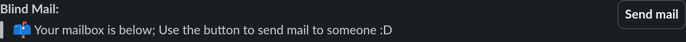
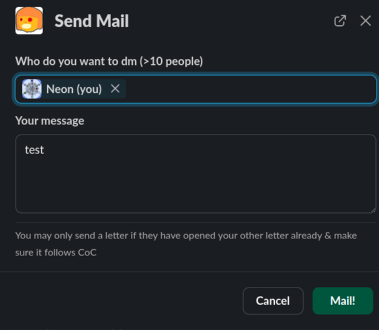

## Blind mail?

### What is blind mail?

it was supposed to be 100% anon mail but that idea was prohibited by hackclub fd so i have made it blind mail.

> How is blind mail diffrent then anon mail?
> Well blind mail just means you dont know who is sending the mail and its a little bit encrypted :3 but if in any case i need to i can decrypt the messages using brute force with user ID's.
> this also means if u get harrasing letters i can find out who its from and report them to FD!

### How does it work?

great question: shitty diagram below.

pretty much: no password enc mail system - reason: no anon service allowed in hackclub so the mail must be accessible.
(db is serverside encrypted)

### How to use it?

Great question, to start go to @Zeon's app home and you should see something like this.

Then to send mail you click the `Send Mail` button!

Then you will be prompted to open a modal to fill out the mail.

Once you have filled it out it will send your mail!!
