# Zeon
this is pretty much just a guide for each one of zeons major features!
## Blind mail
[Learn how that works here](./docs/HOW_BLIND_MAIL_WORKS.md)

## Sticky Messages 
Sticky messages are messages created and  ment to stay at the bottom of the channel. 
This means you can still actively use the channel while the message will stay at the bottom.  
here are the commands:
- *`/stickymessage create <message>`* - create a sticky message! (make sure both zeon's are in the channel!! or its public)
 example:

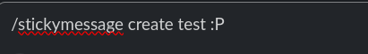

and should look like this after the command is ran:

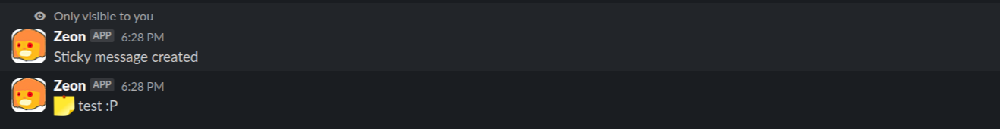

- *`/stickymessage edit <newmessage>`* - Edit a sticky message
 example:

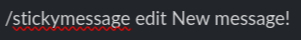

and this is an example of what it should look like after it is ran:

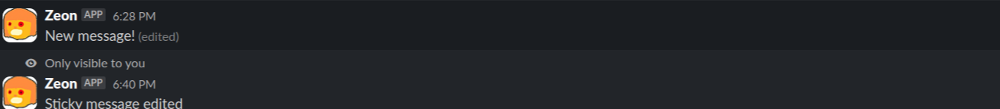
 _prev sticky message is edit to reflect new message_
- *`/stickymessage delete`* - delete a sticky message from the channel and wont send it no more
 example:

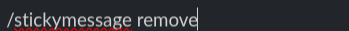

and after it will send this message to the channel and delete the sticky message:
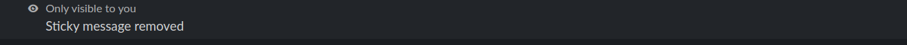

## Hackclub shipment viewer
Hackclub provides a shipment viewer for your shipments!
My system is a WIP as shipment viewer is always changing but it has the following features:
- Showing last 4 shipments in app home
- Sending u updates when a new shipment is added!
To first set it up you need to run the following command: `//zeon-hackclub-shipments <your shipment url>`:
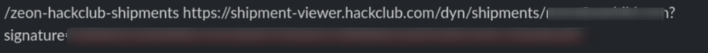
The url contains your **email** and **signature** so be careful not to send it into a public channel!

Once you have set it up you can check @Zeon's app home and after a couple minutes you should see something like this:

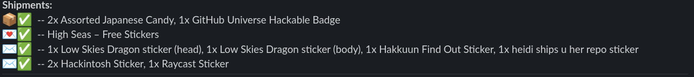

Zeon will also watch to see if you get any new shipments, if u do get a new one or one is modified/updated he will send you a message in the channel!
  messages will look something like this:
<!-- TODO: maybe fix this -->
there will be an img soonnn.

##  Bday System
You can add your bday so zeon will wish you a happy bday!! (you also get a cool little site with it.)
to add your bday you need to execute the following command: `/bday config YYYY-MM-DD` (please note u may have to do +1 to the day since they are 0 index'ed)
Once you have done that on the day of your bday you will get a message in #zeon-bdays with a happy birthday message!

## d20 Dice System
Just type a message in #d20!

##  #hastebin
in #hastebin if you type a message with code blocks it will be uploaded to [my hastebin](https://bin.saahild.com). here is an image example: 

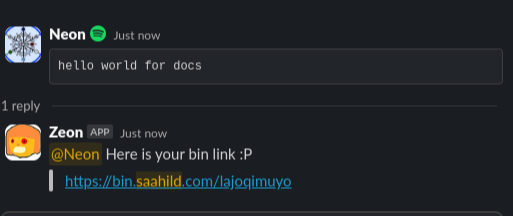

_url from [above](https://bin.saahild.com/lajoqimuyo)_

## #uuid
go to #uuid and just type `gib uuid` and u get a uuid!
example:
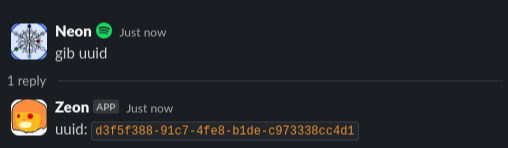

## poll's (comming soon)
not done yet!

## High Seas LB Tracker
the high seas lb which is scraped of the web version can be found [here]() is used in the #high-seas-lb channel and the app home.
the bot displays the top 10 in the app home.
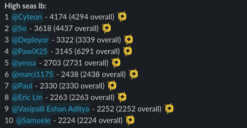

and then in the channel updates are send every 10 minutes with the changes in the lb as well! (see below for examples)

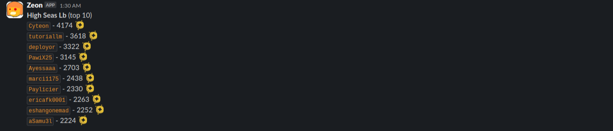
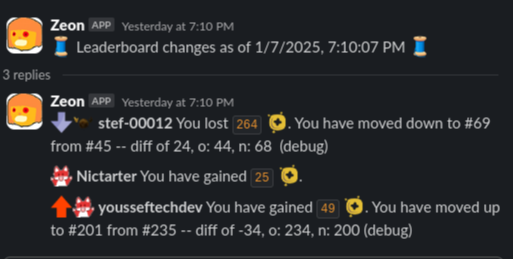

## zeon tags
zeon has a tag like feature where u can create 
the personal tags system has 3 main commands:
- `/tag add`
this command will popup with a modal and you can add what content you want in the tag! 
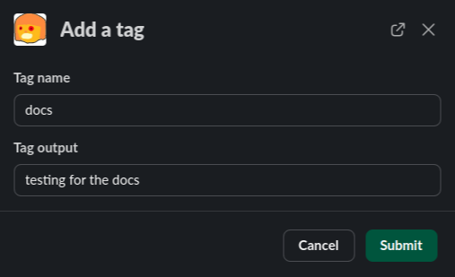

after you submit it, it will dm you a message saying the tag has been saved!.
- `/tag use <tag>`
This will have zeon send the tag into that channel saying you sent it! Please make sure zeon is in the channel for this to work.
- `/tag rm <tag>`
This will remove the tag from the db.
## #whats-my-slack-id
Im just replacing the famous radar bot pretty much..
## advent of code priv lb tracker (not active rn since no aoc)
This was active for the advent of code 2024 but its disabled atm. 
What it used to do is send the priv lb to #adventofcode and have a advent of code lb on the app home.
## hangman
not done yet!
## hackclub cdn
This is pretty much #cdn but you can only use image URLs! to use it run `/zeon-hc-cdn <direct-url>` and your should get something like this: 

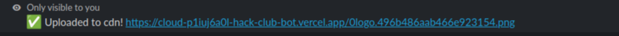
and lasts for pretty much forever! (see uploaded img below)

## CTF (comming soon)
A cool CTF challange which is not out yet :0
## high seas shop
outdated!
## Personal features (undocumented since u cant use them)
- hackatime tracker 
- how was your day 
- code watcher 
- nextdns logs 
- spotify and jellyfin status in slack (personal)
- irl status 
